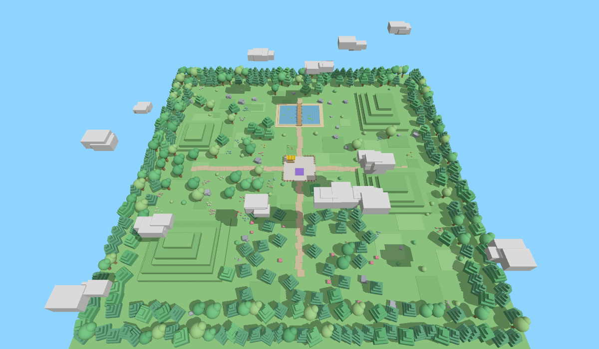

# Kiddo Shop — Roblox shop UI pre deti (simulator štýl)

Bočné menu s ikonami vľavo, STORE okno s oranžovým pruhovaným záhlavím, R$ tlačidlá,
Starter Pack, Server Luck, Game Passes a ponuky vznášajúce sa vpravo —
s animáciami, efektmi (konfety, lesk, lúče) a zvukmi.

Dizajn systém (farby, komponenty, animácie): https://claude.ai/artifact/MBjEgrfa9DZRxWEMVHyeUB

## Hotová hra (najrýchlejšie)

Stiahni **`KiddoShopGame.rbxlx`** a otvor ho v Roblox Studiu (*File → Open from File*).
Je tam všetko: stud-style prírodná mapa (tráva, stromy, kopce, jazierko s mostíkom,
kamene, kvety, huby, oblaky), spawn, stánok **SHOP** (podíď a stlač **E**) a celé shop UI.
Potom *File → Publish to Roblox*.

Mapa sa generuje skriptom `tools/build_map.py` (zmeň seed alebo počty a spusti znova),
place súbor sa skladá cez [Rojo](https://rojo.space): `rojo build -o KiddoShopGame.rbxlx`.

## Len UI do vlastnej hry

1. **StarterPlayer → StarterPlayerScripts** → Insert Object → **LocalScript** →
   vlož obsah `src/StarterPlayerScripts/KiddoShop.client.lua`.
2. **ServerScriptService** → Insert Object → **Script** →
   vlož obsah `src/ServerScriptService/ShopReceipts.server.lua`.
3. Stlač **Play**. Vľavo klikni na **Store** (alebo na ponuku vpravo).

## Nastavenie

- `PRODUCTS` v LocalScripte: ID Developer Productov / Game Passov z Creator Dashboard.
  Kým je `id = 0`, tlačidlo spraví len ukážkový efekt (bez platby).
- `REWARDS` v server Scripte: čo hráč dostane po kúpe (bez toho Roblox nákup nepotvrdí).
- `SFX`: zvuky. Teraz sú tam vstavané zvuky Robloxu, vymeň ich za vlastné `rbxassetid://…`.
- **Ikony** sa kreslia priamo v skripte z tvarov (fungujú hneď, nič netreba nahrávať).
  Voliteľne: ostrejšie PNG z `icons/png` nahraj cez *View → Asset Manager → Bulk Import*
  a ich ID vlož do tabuľky `ICONS` (namiesto `rbxassetid://0`).
- **Pozadie:** všetky panely majú Roblox „studs“ vzor; v STORE sa studs pomaly posúvajú a zozadu stúpajú iskričky.
