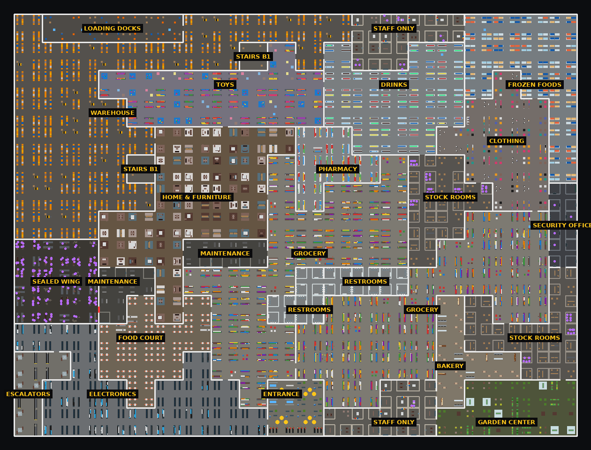
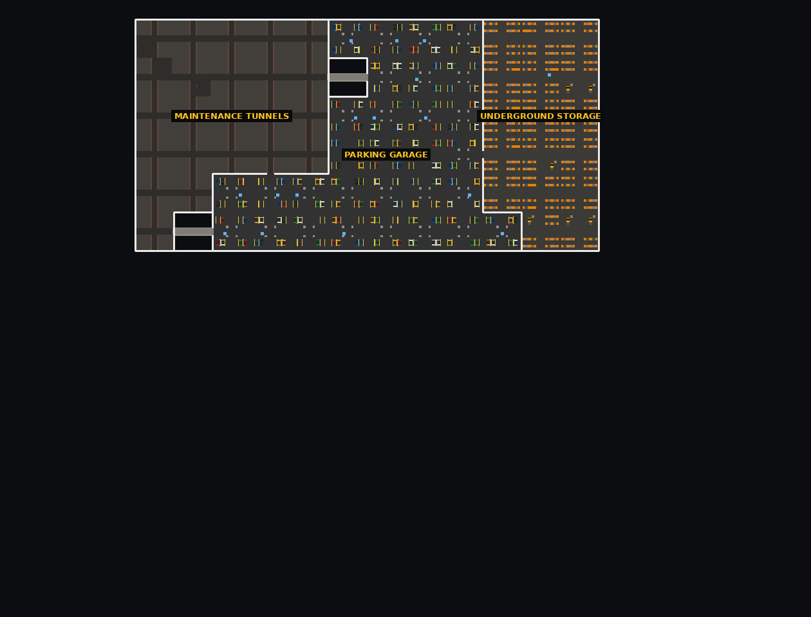

# MASSIVE STORE: LOCUST

Survival horror pre Roblox. Si zavretý v **obrovskom opustenom supermarkete**. Cez deň
prehľadávaš obchod, zbieraš jedlo, materiály a vybavenie a staviaš si základňu. V noci
zhasnú svetlá a obchod začne prehľadávať **THE LOCUST** — vysoké, hmyzu podobné stvorenie,
ktoré je každú noc rýchlejšie, lepšie počuje a ľahšie rozbíja steny.

```
LOOT → BUILD → SURVIVE → UPGRADE → PREŽI ĎALŠIU NOC
```

Hra má **dva place-y** (jeden Roblox experience):

| Súbor | Place | Čo tam je |
| --- | --- | --- |
| **`MassiveStoreLobby.rbxlx`** | **Lobby** (štartovací place) | parkovisko pred obchodom, party, pozvánky, výber módu, outfity, shop, misie |
| **`MassiveStoreLocust.rbxlx`** | **Game** (obchod) | samotná hra v **first-person**; každý run je súkromný (rezervovaný) server |

**SOLO** = teleport do vlastného súkromného servera len pre teba. **PARTY** = celá party sa
teleportuje spolu do jedného súkromného servera. Po hre **BACK TO LOBBY** vráti party spolu.

UI je navrhnuté vo **Figme**: [MASSIVE STORE: LOCUST — UI](https://www.figma.com/design/j2isfuKLgJTi75wSVQlhv4)
(lobby, štart runu, teleport/loading, HUD, inventár, stavanie, shop, výsledky) a hra ho
presne kopíruje (farby, Oswald / Montserrat / Roboto Mono, panely, tlačidlá).

Všetko (mapa, modely, Locust, ikony, UI, zvuky) je vyrobené kódom — nie sú potrebné žiadne
nahraté assety. Hra je pôvodná: nepoužíva nič z 3008 (assety, mapu, mená, UI ani kód).



---

## Ako to vyskúšať v Studiu

**Obchod (hra):**
1. Otvor `MassiveStoreLocust.rbxlx` → **Play** (alebo *Test → Clients and Servers → 2–4 Players*).
2. Objaví sa **STUDIO TEST** panel → vyber mód (PLAY SURVIVAL / INFECTION / HARDCORE / SOLO).
3. Si v obchode v first-person. Prvý deň trvá 5 minút; rýchly test noci: v
   `ReplicatedStorage/Shared/Config` zníž `Cycle.FirstDay` a `Cycle.Day` napr. na 30.

**Lobby:** otvor `MassiveStoreLobby.rbxlx` → Play. Uvidíš parkovisko, svoju postavu pred
obchodom, menu, party panel, shop, outfity. V Studiu teleporty nefungujú, takže ENTER THE STORE
napíše, že treba publikovať (party, pozvánky medzi hráčmi v lobby a ready sa dajú testovať cez
*Clients and Servers*).

> **Ukladanie dát:** *File → Publish to Roblox*, potom *Game Settings → Security →
> Enable Studio Access to API Services*. Bez toho hra funguje, len sa XP/kredity neuložia
> (menu ukáže „progress isn't saving“).

### Po publikovaní (prepojenie lobby ↔ hra)
1. Vytvor experience a publikuj **`MassiveStoreLobby.rbxlx` ako štartovací place** (*File →
   Publish to Roblox*).
2. V Creator Dashboard → experience → **Places → Add Place**, otvor `MassiveStoreLocust.rbxlx`
   a publikuj ho do tohto nového place-u (*File → Publish to Roblox As… → existujúca hra → ten place*).
3. ID oboch place-ov zapíš do `ReplicatedStorage/Shared/Config` → `Config.Places = { Lobby = …, Game = … }`
   **v oboch súboroch** a publikuj ich znova.
4. Game Settings → **Security → Allow Third Party Teleports** netreba (teleporty sú v rámci
   jedného experience). Zapni *Enable Studio Access to API Services* pre ukladanie.
- *Game Settings → Places → Max Players*: lobby napr. **30**, hra **12**.
- Kredity za Robux (voliteľné): vytvor 3 Developer Products a ich ID daj do
  `Config.CreditProducts`. Kým sú `0`, obchod píše, že balíčky nie sú nastavené.
- Odporúčaný avatar: R15 (R6 tiež funguje).

---

## Ovládanie

| Klávesa | Akcia |
| --- | --- |
| myš | rozhliadanie (first-person; citlivosť v Settings) |
| WASD / Shift | chôdza / šprint (hlučný!) |
| C (alebo držať Ctrl) | krčenie — tichý pohyb, horšie ťa vidno |
| E | interakcia (zobrať, otvoriť, skryť sa, oživiť – podržať) |
| 1–6, klik | držať predmet / použiť (jesť, hodiť svetlicu…) |
| Q | zahodiť držaný predmet |
| Tab | inventár (klik = vybrať, klik na iný slot = presunúť) |
| B | stavanie · R otočiť · klik postaviť · pravý klik zrušiť |
| U / P / X | (v režime stavania, mierenie na stavbu) vylepšiť / opraviť / odstrániť |
| F / R | baterka / vymeniť batérie |
| N | nočné videnie (ak máš okuliare) |
| M | mapa obchodu |
| G / X | pustiť vozík / otvoriť kôš vozíka |
| L | druhá akcia pri dverách / generátore (zamknúť, doplniť palivo) |
| H | emoty |
| Space | vyliezť zo skrýše |
| P | pauza: outfity, misie, nastavenia, späť do lobby |

V lobby: **Enter** = PLAY SOLO, **P** = PLAY WITH PARTY, **L** = outfity, **B** = shop.

Mobil: tlačidlá USE / RUN / SNEAK / LIGHT / BAG / BUILD + MAP / CART / DROP. Gamepad: R2 použiť,
L3 šprint, R3 krčenie, Y stavanie, D-pad predmety.

---

## Čo je nové vo verzii 2

### Lobby + party + teleporty
- **Lobby place**: nočné parkovisko pred MASSIVE STORE. Každá party má vlastný „pad“ — kúsok
  fasády obchodu (svietiaci nápis, posuvné dvere so svetlom vnútri, lampy, vozíky) a party
  stojí v rade pred ním; kamera je filmová (jemný pohyb + paralaxa myšou).
- **Party** (max 4, `Config.Party`): pozvať hráča v lobby (JOIN / NO toast s časovačom),
  **pozvať Roblox priateľov** (Roblox pozvánka nesie kód party — po príchode sa automaticky
  pridajú), **pripojiť sa kódom** (`# K7Q-2M4`), odísť, vyhodiť (líder), READY.
- **START A RUN** (Figma 02): SOLO | PARTY, karty SURVIVAL / INFECTION / HARDCORE
  (sila Locusta, loot, smrť), líder vyberá, ostatní dajú READY, líder spustí **ENTER THE STORE**.
  SOLO + SURVIVAL = mód Solo (samo-oživenie), INFECTION potrebuje aspoň 2 hráčov.
- Spustenie: `TeleportService:ReserveServer` + **jeden** `TeleportAsync` pre celú party
  (pristanú spolu), TeleportData `{ Mode, Rules, PartyKey, Leader, Members }`.
- V hre: hráči z lobby rovno vojdú do obchodu. Na konci runu **BACK TO LOBBY** (hlasujúci idú
  spolu, lobby party obnoví aj s lídrom a pravidlami) alebo **NEW STORE**. Kto dá v pauze
  BACK TO LOBBY uprostred runu, nechá batoh na zemi pre tím.
- Prechod medzi place-mi kryje obrazovka „pokladničný bloček“ (Figma 03), ktorá ostane na
  obrazovke aj počas samotného teleportu (`SetTeleportGui` / `GetArrivingTeleportGui`).

### First-person
- V obchode `LockFirstPerson`. **Viewmodel**: dve ruky (farba pokožky, rukávy vo farbe outfitu)
  a predmet v ruke — rovnaké úchopy ako v tretej osobe (`Shared/Holding`):
  baterka mieri kam pozeráš (šošovka svieti keď je zapnutá), kladivo/páčidlo/obušok v päsni,
  jedlo pred sebou, dosky/lekárnička/kanister oboma rukami, vozík oboma rukami na rukoväti.
- Vrstvy: vytiahnutie predmetu, kývanie pri chôdzi/šprinte (šprint = predmet sklopený),
  oneskorenie za myšou (pružina), skok/dopad, dych, krčenie.
- Akcie: **švih** (kladivo, páčidlo, obušok, stavanie), **jedenie / pitie** (k ústam),
  **liečenie**, **hod** (svetlica, repelent), **položenie**, **výmena batérií**, cvaknutie baterky.
  Klient ich prehrá hneď (bez oneskorenia), server ich rozošle ostatným.
- Otvorené okná (inventár, mapa, pauza, výber v stavaní, výsledky) uvoľnia myš.

### Vlastné animácie postáv (bez nahratých animácií)
Predvolený `Animate` je vypnutý; `Client/CharacterAnimator` hýbe kĺbmi (R15 aj R6) u všetkých
hráčov: idle (dych, prenášanie váhy, rozhliadanie), chôdza/beh s krokom podľa skutočnej
rýchlosti (žiadne kĺzanie nôh), cúvanie, krčenie, výskok, pád, dopad s prepružením, lezenie,
plávanie, sedenie, zrazený (plazenie), skrytý, držanie predmetov (Aim / Melee / OneHand /
TwoHand / Push) a všetky akcie vyššie. Emoty (animation tracks) majú prednosť.

### Lepšie modely
- **Predmety**: plechovky s okrajmi, etiketou a otváračom, fľaše s hrdlom a uzáverom,
  baterka s ryhovaným gripom, vypínačom, hlavou a sklom, kladivo s gumovým gripom a pazúrom,
  páčidlo s hákom, obušok s hrotmi, lekárnička s rukoväťou a zámkami, kanister s hubicou,
  dosky s klincami, plechy so skrutkami, doska plošných spojov, burger, torta, kura…
- **Regály (LOD)**: `Client/ShelfDresser` pri hráčovi nahradí farebné bloky tovarom —
  rady plechoviek, krabíc cereálií, fliaš, pohárov a vrecúšok chipsov s etiketami
  a cenovkami; ďaleko sa vráti jednoduchý blok (výkon).
- **Vozík**: drôtený kôš, kolieska s vidlicami, sklápacie sedadlo, nárazníky, logo.
- **THE LOCUST**: tŕne na chrbte, pancierové platne, segmenty bruška so svietiacimi
  prieduchmi, žihadlo, hrebeň, menšie oči, dvojdielne kusadlá, makadlá, kudlankové tŕne na
  predlaktiach, žily na krídlach + zadné krídla, kolená, ostrohy.

## Čo v hre je

### Obchod (procedurálny)
Každý server vygeneruje **nový obchod** (`StoreLayout`, seed). Mriežka 20×15 buniek po 80 studov
(≈1600×1200 studov) + podzemie. Prejsť z jednej strany na druhú trvá minúty.

- Oddelenia: Grocery, Drinks, Frozen Foods, Bakery, Food Court, Electronics, Home & Furniture,
  Garden Center, Pharmacy, Toys, Clothing, Restrooms, Staff Only, Stock Rooms, Security Office,
  Warehouse, Loading Docks, Maintenance, Escalators (pokazené eskalátory), Entrance.
- Podzemie **B1**: Parking Garage, Underground Storage, Maintenance Tunnels (otvorí sa na
  **noc 10** alebo kartou Security Keycard).
- **Sealed Wing** (otvorí sa na noc 20) – najlepší loot.
- **Zamknuté miestnosti** (páčidlo / karta) a **skryté miestnosti** za uvoľneným panelom.
- Regály s tovarom, rozhádzaný tovar, palety, vozíky, tabule „AISLE 12“, blikajúce svetlá…
- Skrýše: skrinky, kabínky na WC, pulty pokladní, skrine, kabínky v obchode s oblečením,
  záhradné kôlne, vetracie šachty.



### Deň a noc
- **Deň**: Locust spí. Lootuj, staviaj, opravuj. Tímový cieľ dňa dáva XP.
- **Súmrak**: svetlá blikajú, „NIGHT IS COMING“.
- **Noc**: väčšina oddelení úplne zhasne, niektoré bežia na červenom núdzovom svetle,
  objaví sa banner **NIGHT N — THE LOCUST IS HUNTING** a Locust sa zjaví ďaleko od hráčov.
- **Úsvit (6:00)**: odmeny (XP, Store Credits), mŕtvi sa vrátia (do postele, ak si ju
  postavili), obchod sa doplní.
- Keď sú v noci všetci dole → **THE STORE CLAIMED YOU** → výsledky → nový obchod.
- Každých 10 nocí **THE STORE SHIFTS**: otvoria sa nové oblasti, zamknuté miestnosti sa
  znova zamknú s novým tovarom, lepší loot, nové varianty Locusta.

### THE LOCUST (AI)
Nevie, kde si. Musí ťa **vidieť** (zorné pole, tma ho oslabuje, baterka ťa prezradí, krčenie
pomáha), **počuť** (šprint, vozíky, stavanie, generátory, dvere, svetlice…) alebo byť **veľmi
blízko**. Pamätá si, kde sa hráči zdržiavajú a kde sú základne, a vracia sa tam.

Stavy: hliadkovanie → vyšetrovanie zvuku → prehľadávanie → naháňačka → rozbíjanie → ústup.
Ďaleké trasy ide po „pruhoch“ obchodu (A*), blízko používa PathfindingService.
Prekážky: slabé stavby rozbije, vozíky odsunie, dvere otvorí (od noci 2), inak hľadá inú cestu.

Fér pravidlá: keď ťa dlho nevidí, vzdá to; dlhá naháňačka ho „frustruje“; zostrelený
odhodlaním (veže, pasce, obušok) **ustúpi**; do repelentu nevojde; nekempuje pri zrazenom hráčovi.

| Noc | Čo pribudne |
| --- | --- |
| 1 | pomalý (pod rýchlosťou šprintu), slabý, zle vidí v tme |
| 2 | otvára dvere obchodu a odomknuté dvere |
| 3 | rozbíja drevené barikády, učí sa (pamäť), láka ho svetlo základne |
| 4 | prehľadáva skrýše |
| 5 | prehľadáva základne, rozbíja drevené steny a dvere |
| 7 | Shriek – výkrik odhalí hráčov a rozbliká baterky |
| 10 | rozbíja kovové stavby · otvorí sa podzemie |
| 12 | Lunge – výpad na krátku vzdialenosť |
| 15 | rozbíja zosilnené stavby, Light Surge vyradí svetlá |
| 20+ | Advanced stavby, roj Nymf (malí prieskumníci), variant HOLLOW LOCUST |
| 30+ / 40+ | IRON LOCUST / SWARM QUEEN |

Rýchlosť a sila sú zastropované, aby sa dalo vždy prežiť taktikou.

### Prežitie
Zdravie, hlad, výdrž (šprint), energia (spánok v posteli, káva, energetáky).
Pri 0 HP si **zrazený** (plazíš sa, krvácaš) – spoluhráč ťa oživí podržaním E.
Solo: oživíš sa sám lekárničkou. Hardcore: oživenie stojí lekárničku.

### Loot
5 vzácností (COMMON → LEGENDARY), ~45 predmetov: jedlo a pitie, stavebné materiály, nástroje
(baterka, kladivo, páčidlo, svetlice, budík, karta, paralyzačný obušok), batérie, lieky, palivo,
špeciálne (mapa obchodu, repelent, maják zásob, nočné videnie, šťastná minca).
Tisíce miest na loot, každý server iné rozloženie, každú noc vzácnejšie.

### Stavanie
Steny, dvere (zamykateľné), okná, barikády, podlahy/stropy, rampy, stoly, úložné boxy (limitované
sloty), postele (respawn), lampy, kamery, pasce, šokové platne, strážne veže, generátory
a kozmetické dekorácie. Stupne **WOOD → METAL → REINFORCED → ADVANCED**. Materiály sa berú
z inventára aj z vozíka, ktorý tlačíš.

### Elektrina
Generátor (palivo) napája zariadenia v dosahu do svojej kapacity. Došlo palivo →
**THE BASE GOES DARK**. Záložné generátory obchodu treba opraviť a natankovať — potom svieti
celé okolie aj v noci. Generátory sú hlučné.

### Vozíky, tím, udalosti
- Vozíky: tlač (E), kôš je kontajner; vylepšenia košíka a koliesok cez úrovne; hlučné.
- Tím: dávanie predmetov, spoločné stavanie, oživovanie, zoznam preživších so smerom.
- Náhodné udalosti: POWER OUTAGE, SECURITY ALERT, SUPPLY DROP, LOCUST ROAR, LOCKDOWN,
  GENERATOR FAILURE, RARE LOOT.

### Módy
| Mód | |
| --- | --- |
| SURVIVAL | klasika, 1–12 hráčov |
| INFECTION | od noci 2 sa jeden hráč zmení na infikovaného lovca; nákaza sa šíri, ráno zmizne |
| HARDCORE | menej zásob, silnejší Locust, oživenie len s lekárničkou |
| SOLO | pre jedného hráča, samo-oživenie lekárničkou |

Mód sa vyberá v lobby; každý obchod je súkromný server pre teba alebo tvoju party
(verejný server herného place-u pošle hráča do lobby).

### Progres, misie, obchod
- Survival XP za noci, vzácny loot, oživenia, stavanie, objavovanie, tímové ciele, misie.
- Úrovne odomykajú väčší inventár, lepšiu baterku, lepší vozík, vyššie stupne stavieb, tituly.
- **Denné misie** (3 denne) → Store Credits + XP.
- **SHOP** len kozmetika: tituly, outfity, farby baterky, farby vozíka, efekty, emoty, dekorácie
  základne. Nič, čo pomáha prežiť, sa nedá kúpiť.

---

## Štruktúra

```
massive-store/
  default.project.json               Rojo projekt — GAME place (obchod)
  lobby.project.json                 Rojo projekt — LOBBY place
  MassiveStoreLocust.rbxlx           zostavený game place
  MassiveStoreLobby.rbxlx            zostavený lobby place
  src/ReplicatedFirst/LoadingScreen  loading screen (oba place-y)
  src/ReplicatedStorage/Shared/      zdieľané (server + klient)
    Config        VŠETKY čísla (časy, prežitie, Locust, módy, loot, ekonomika)
    StoreLayout   generátor obchodu (čisté dáta) · Zones · Nav (A*)
    Items, Rarity, Buildables, Cosmetics, Progression, Missions
    InventoryCore, LocustRig, Models, Net, Signal, Util
    Holding       úchopy predmetov + ktorá akcia/animácia patrí ku ktorému predmetu
    PartyRules    SOLO/PARTY × pravidlá → mód, kódy party
  src/ServerScriptService/
    Main.server   spustí všetko
    Services/     World, Director, Locust, Survival, Inventory, Loot, Building, Power,
                  Carts, Tools, Defense, Events, Infection, Modes, Shop, Progress, Data,
                  Noise, Prompts, State, RateLimiter
  src/StarterPlayerScripts/
    Main.client   spustí klienta
    Client/       UI (dizajn systém z Figmy), Menu (studio test + pauza), Pages (outfity,
                  shop, misie, nastavenia), HUD, InventoryUI, BuildUI, MapUI, PromptUI,
                  ViewModel, CharacterAnimator, ShelfDresser, TeleportScreen, MenuScene,
                  Atmosphere, Audio, LocustAnimator, CameraFX, Controls, ClientState
  src/Lobby/                         LOBBY place (zdieľa Shared + Data/Shop/Progress + UI moduly)
    ServerScriptService/Main.server  Lobby/Party (party, pozvánky, teleport), Lobby/LobbyWorld
    StarterPlayerScripts/Main.client Lobby/LobbyUI (Figma 01/02 + okno pozvánok), Lobby/LobbyCamera
  tests/          testy generátora + headless simulácie servera aj klienta
  tools/          check.sh (lint), test.sh (všetky testy), render_map.py (náhľad mapy)
```

## Úpravy

| Chcem… | Kde |
| --- | --- |
| dĺžku dňa/noci, hlad, rýchlosti, silu Locusta, odmeny | `Shared/Config` |
| veľkosť obchodu, počet zamknutých miestností | `Config.Map` |
| nové oddelenie | riadok v `Shared/Zones` (+ `Fill` v `StoreLayout`) |
| nový predmet | riadok v `Shared/Items` (model aj ikona sa vytvoria samé) |
| novú stavbu | riadok v `Shared/Buildables` |
| kozmetiku | `Shared/Cosmetics` |
| zvuky | `Client/Audio` → tabuľka `LIB` (nahraď `Id` vlastným `rbxassetid://…`) |

Zvuky sú poskladané zo vstavaných zvukov Roblox klienta (`rbxasset://sounds/...`) s efektmi
(pitch, skreslenie, reverb). Pre finálnu atmosféru odporúčam nahradiť ich vlastnými nahratými
zvukmi — stačí zmeniť ID v `LIB`, recepty (vrstvy, efekty) ostanú.

## Bezpečnosť
Klient len **žiada**. Server rozhoduje o všetkom: zdraví, hlade, rýchlosti (aj kontrola
rýchlosti pohybu), inventári (sloty, množstvá, dosah, kto má kontajner otvorený), stavaní
(odomknutia, mriežka, dosah, prekrývanie, materiály), poškodení, XP, kreditoch a nákupoch
(idempotentné spracovanie Robux nákupov). Všetky remotes majú rate-limit.

## Výkon
StreamingEnabled, ukotvené diely bez fyziky, malé diely bez raycastov/tieňov, jeden AI
„mozog“ s tickom 0.2 s, vizuálne efekty (svetlá, blikanie, animácia Locusta, zvuky) len
na klientovi, stav hráča cez atribúty, tímové info 1× za sekundu.

## Testy a build
Potrebné: [Rojo](https://rojo.space) a Luau CLI (`luau`, `luau-analyze`, `luau-compile`).

```
LUAU_BIN=/cesta/k/luau tools/test.sh     # lint + testy + 10 simulácií (server, klient, lobby)
rojo build default.project.json -o MassiveStoreLocust.rbxlx
rojo build lobby.project.json -o MassiveStoreLobby.rbxlx
python3 tools/render_map.py 2024         # náhľad mapy do docs/
```

Simulácie spúšťajú skutočný kód hry na falošnom Roblox engine (virtuálny čas, boti):
viac dní a nocí, Locust (naháňačka, zrazenie, oživenie, skrývanie, rozbíjanie, ústup),
základňa s elektrinou a obranou, všetky udalosti, noc 10 a 25, všetky módy, súkromné servery
z lobby (mód z TeleportData, návrat party do lobby), lobby (party, pozvánky, kódy, ready,
spoločný teleport, návrat party) a celý klient (loading, studio test, pauza, stránky,
first-person viewmodel, animácie, HUD, inventár, stavanie, mapa, výsledky).
Nenahrádzajú test v Studiu (fyzika, vzhľad, zvuky), ale chytia chyby v logike.
